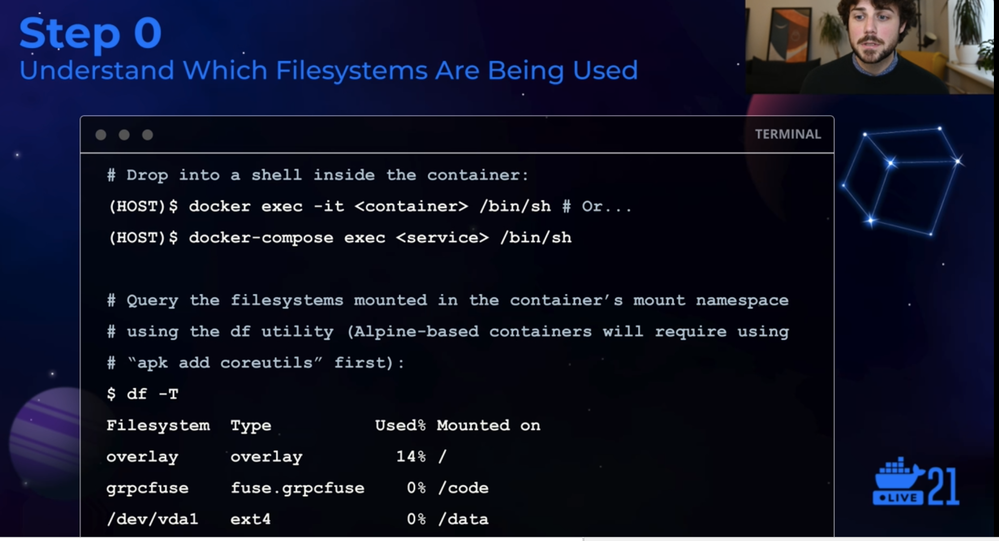
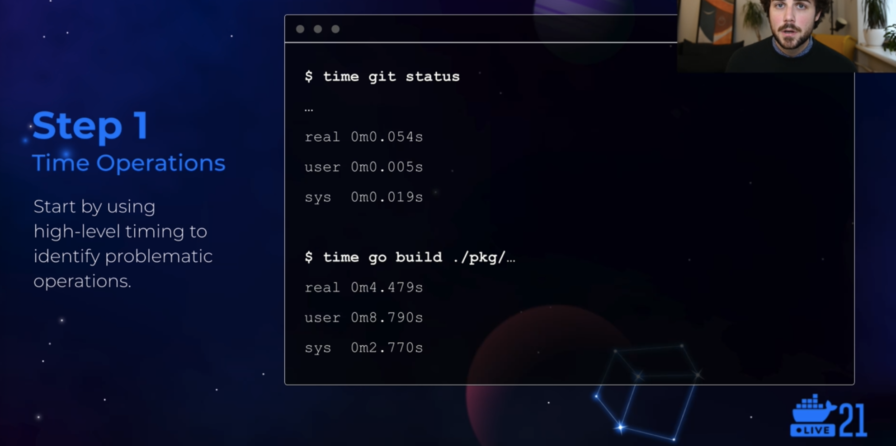
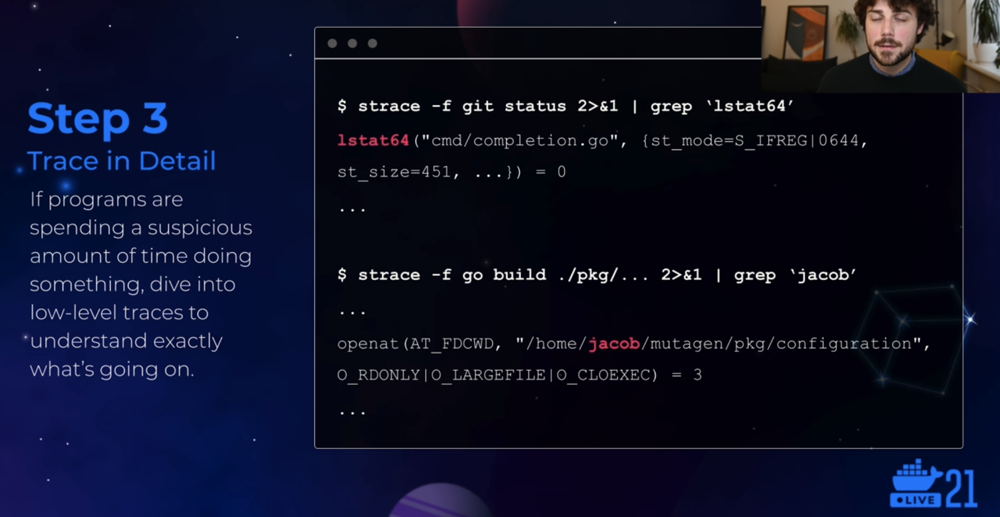
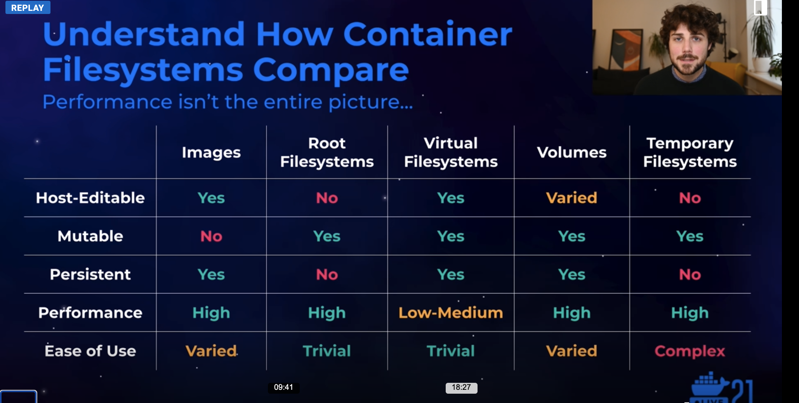
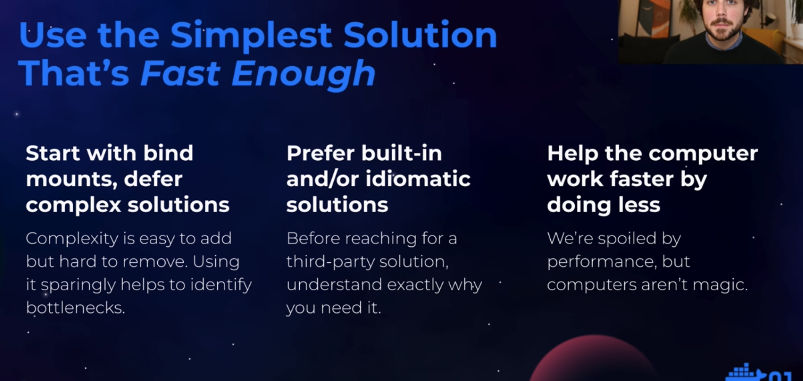
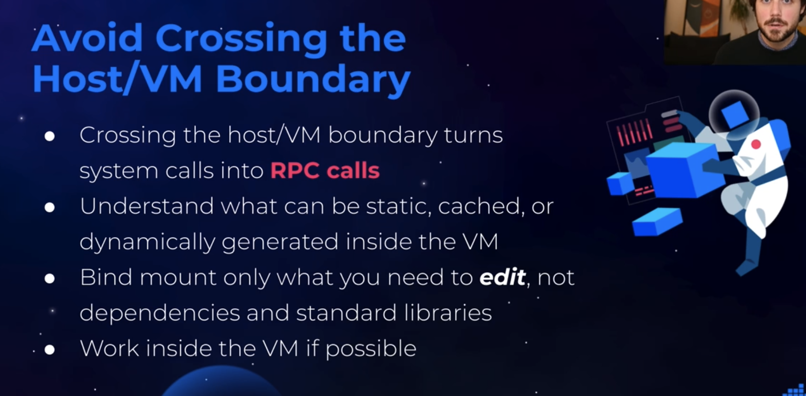
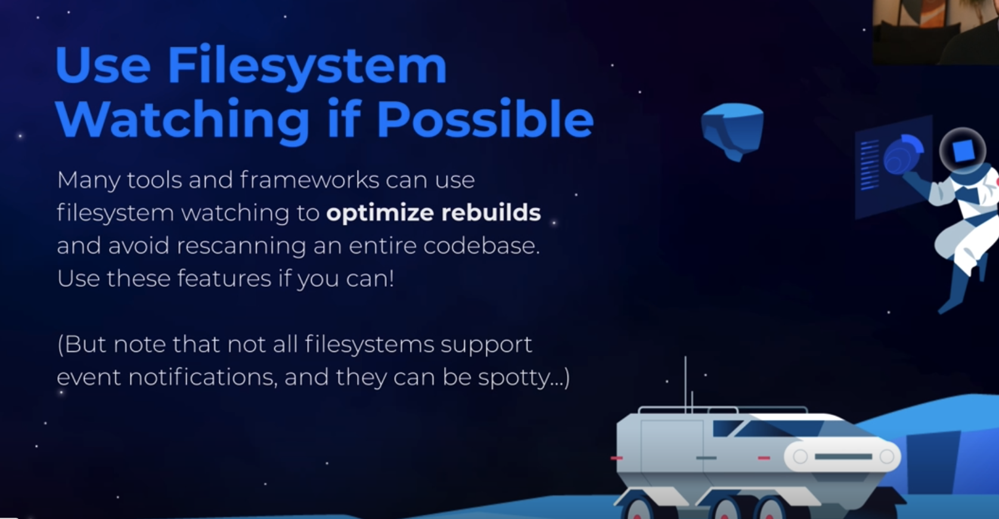

## What Are Containers?
Convenient isolation and portability
  - Containers combine Linux kernel mechanisms like `namespaces` and `cgroups` into a unified abstraction
  - Namespaces allow processes to have different views of OS resources
  - Mount namespaces regulate the filesystems that containers can see
  - Multiple filesystems are used to support the container abstraction

## Filesystems
There are essentially five categories:
- Images
- Container root filesystems
- Bind mounts
- Volumes
- Temporary filesystems

## Images
Static distributable "filesystem" roots
- Snapshots of a filesystem with metadata
- Built and distributed in a layered fashion
- Derived from a base image
- Stored and distributed as tarballs
- Standardized by OCI
- Excellent storage for tools (and some dependencies)

## Container Root Filesystems
Images reified for use by containers
- Layers of an image converted to a mountable filesystem
- `OverlayFS` is the primary mechanism
- Can also track changes to generate new image layers from temporary containers
- Mutable not persistent
  - Good performance but they don't live past the end of the container (except for the snapshots)
- Reasonable performance for simple tasks

## Bind Mounts
Host files made available to containers
- Existing fs paths made accessible in different locations (even across namespaces)
- Not something specific to containers
- No performance penalty *natively*
- Impelment using **virtual filesystems** in Docker Desktop
  - `gRPC-FUSE` on macOS (prev. osxfs)
  - 9P on Windows
- Excellent for code you need to **edit**

## Volumes
Persistent, performant, mutable storage
- Bind mounts with arbitrary storage
- Just folders in Docker Desktop
  - But **inside** the virtual machine!
- Plugins exist for alt storage
- Can be attached to multiple containers simultaneously
- Excellent performance characteristics
- Great for storing data and/or code

## Temporary Filesystems
Ephemeral in-memory storage
- Standard Linux `tmpfs` filesystems
- Good performance
- **No persistence**
  - Not a good option for code

# Performance Considerations for Containerized Development
## Developer Tools are Different (and Demanding)
- Filesystem access very different than casual computing or production use cases
- Assets loaded dynamically and repeatedly
- Typically O(n) behaviour in terms of `getdents`, `stat`, `open`, `read` and `close` system calls
- These don't behave as well on virtual fs
- Modern dependency mgmt can easily bring in 10-100K files (or more)
- Also brutal in terms of CPU (e.g. compiling) and memory usage (e.g. linking)

## How to Approach Performance
If things are fast enough, just leave them
- There's no point in prematurely optimizing

Figure out what slow programs are actually doing
- Macrobenchmarks aren't very informative. Microbenchmarks of the wrong things are irrelevant. Understand *your* tools' system calls.

Perform comparative benchmarks of relevant operations on relevant systems
- Use the actual software (or a rep sim) and hardware to compare fs and understand potential gains.

## Next Steps
- Help the computer do less work
  - Identify suspicious or unnecessary work being done by tools and scripts.
  - Removing this work is easier than optimizing
- Try alternatives and understand gains
  - Perform the same op on different fs and understand the potential gains and tradeoffs
- Dig deeper with other tools
  - Use more advanced strace features or tools like eBFP

