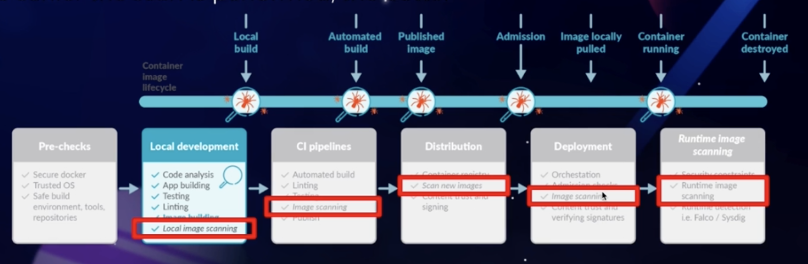

Unify `RUN` commands
Use `.dockerignore` file to specify what should be excluded from the buildc
Image scanning
  - Detect bad practices and known vulnerabilities
  - The earlier the scan is performed, the better

Avoid running your environment as root
- Openshift and some Kubernetes clusters can help

Restrict application capabilities on runtime

Remember: update often + versioning strategy

Tags can mutate!

The docker socket is a big privileged door into your host system
- Make sure /var/run/docker.sock has the correct permissions
- If docker is exposed via TCP, make sure it is properly protected
