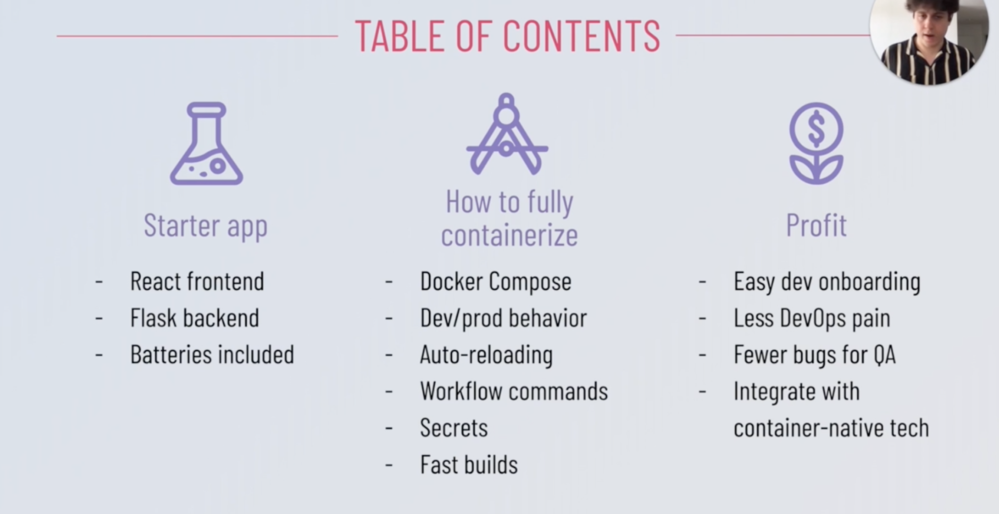
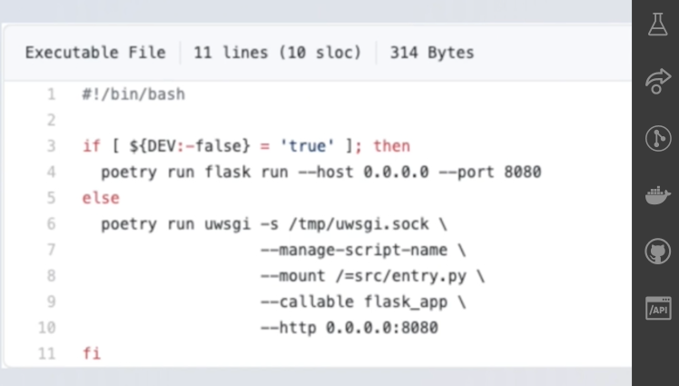
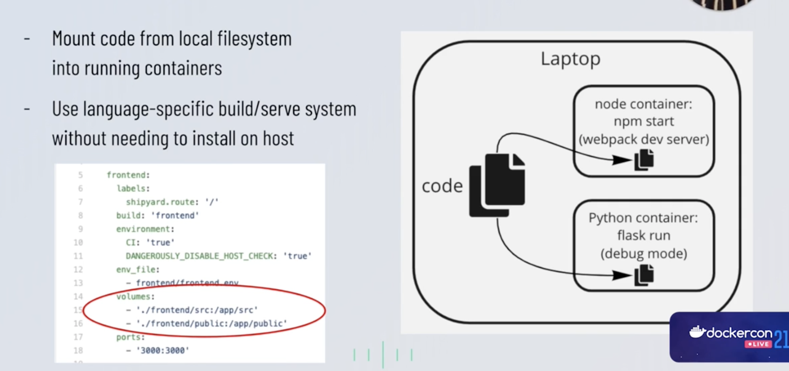
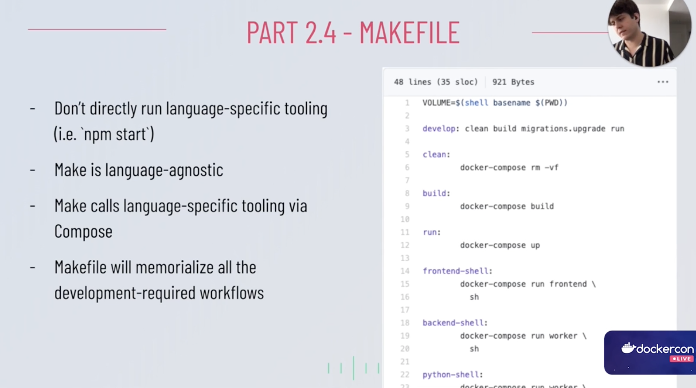
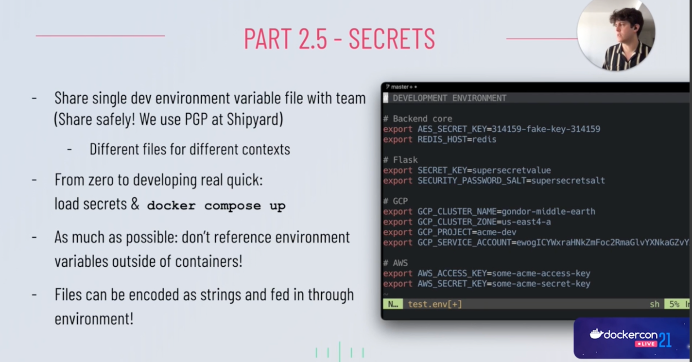

2.1 Docker Compose

2.2. Entrypoints
Avoid having mostly duplicate Dockerfiles
Avoid running language specific commands needed for development
Minimize the difference between dev and prod (same image different startup)

2.3 Auto-reloading

2.4 Makefile

2.5 Secrets

Base64 can convert files into strings

2.6 Fast Builds
- Build with docker buildkit -> this is really fast

3.1 Easy onboarding
- If only software requirements are Make and Docker:
  - Devs can run all software in your org from day one!
    - provided you have all the secrets
  - Actually fulfills the container promise of eliminating "it works on my machine"

3.2 Less DevOps pain
  - Doing everything in containers brings the local setup closer to production
  - Less logic duplication in CI/CD, deployment and pipeline
  - All teams familiar with same tooling

3.3. Fewer bugs for QA

3.4. Container-native Tooling
- Compose specification has its own life outside of Docker
  - Community-driven, long term support, extensible
  - Supported format for other tools & clouds (incl. AWS, GCP)
