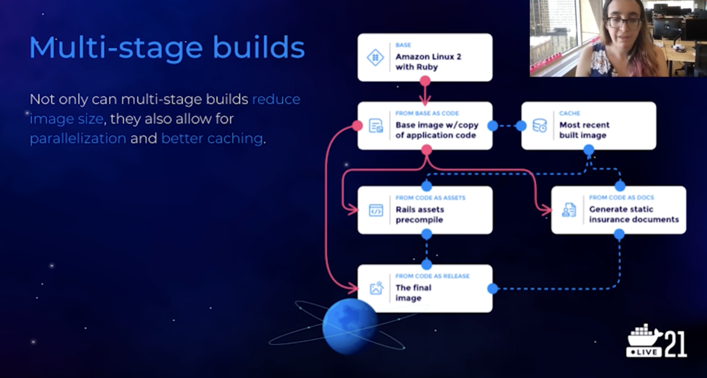

Buildkit - docker's new build inline caching
- Opentelemetry tools tightly coupled to Jaeger

`buildctl` supports writing JSON formatted opentraces to a file

Jenkins agent -> file -> S3 bucket

Optimizations
- Caching dependency install
- Bootsnap caching for faster startup
- Lazy loading the Rails framework
- Revisiting Buildkit inline caching

Learnings:
Implement observability before prematurely optimizing. The result will be simpler and faster.
- Better to optimize the slowest builds, instead of generalizing best practices
