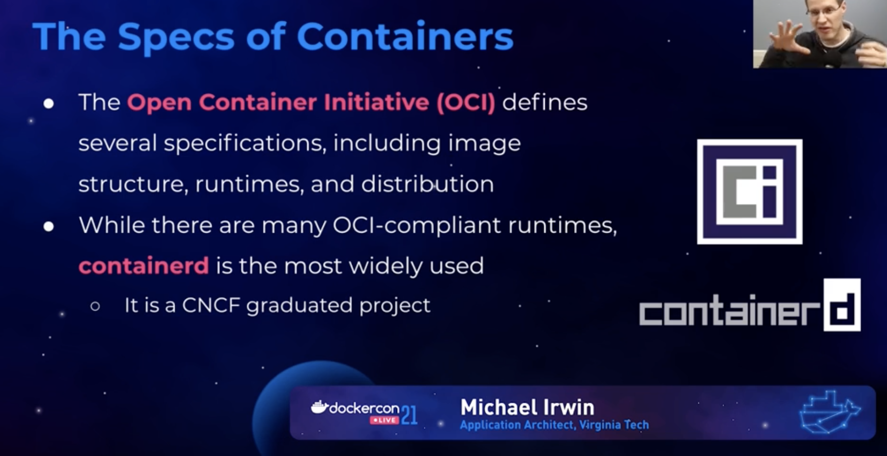
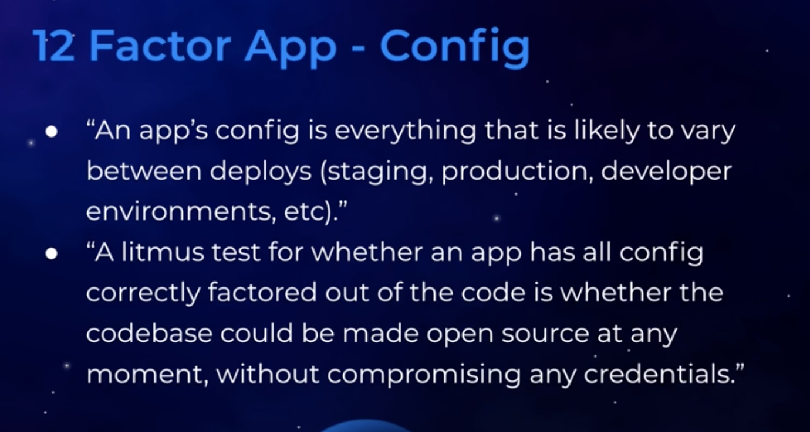
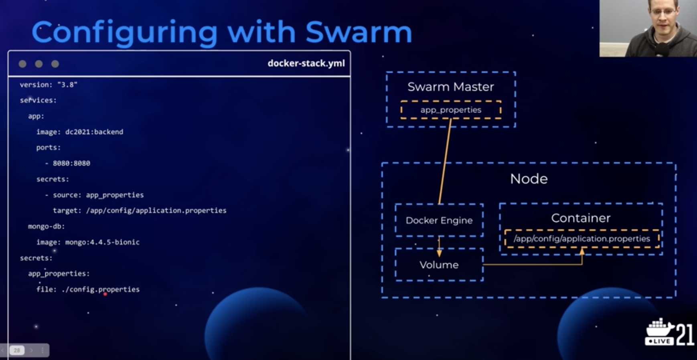
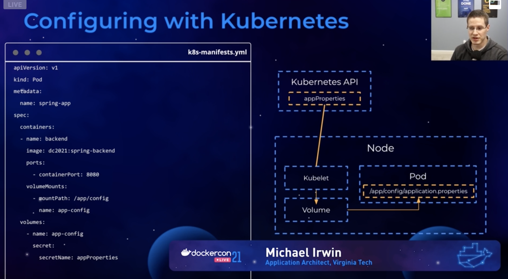
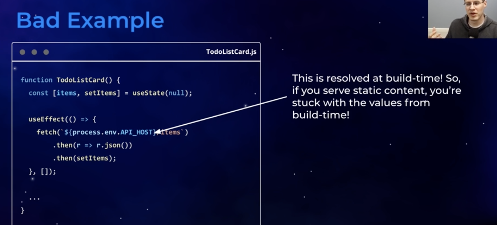
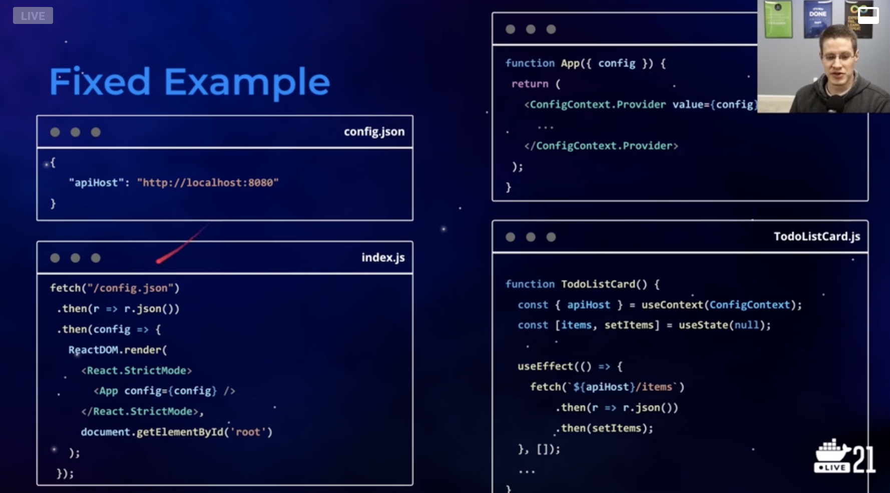
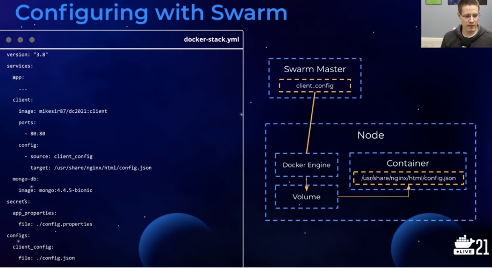

Configuring Applications
12factor.net

Types of Configuration
- Encompasses anything that might vary b/w deployments
- Two subcategories:
  - config
  - secrets

Environment variables
- stores config in env var
- Supported by the OCI runtime spec
- Variables defined (in the parent process) and passed along to a process (children process)
- All processes, by default, inherit the environment of its parent
- most languages/frameworks process access to env variables (e.g. `process.env` in node)
- Env var are completely fine for:
  - changing options
  - changing labels
  - configuring non-secret data
- They should RARELY be used for secret data:
  - they are leaked far too often (logs, debug info, etc.)

Config in Files
- By levering mounts, we can inject files into containers
  - Mounts are part of the OCI runtime-spec
- By storing config in files, we remove the possibility of it being leaked in env var dumps
- App can then read the file contents and configure
  - Does require an understanding of the file structure/schema (yaml/toml/JSON, etc)
- The file contains the sensitive data
- The env var is a pointer to the location of the file

File Sources for Containers
- For local dev, use file mounts
- When running with orchestration, use config/secrets
- Configure your env for what's easiest
  - It's perfectly fine to have separate YAML/manifests between dev and prod

Secrets in Orchestration
- stored in the cluster and provided to only authorized containers
- to an app, a secret is simply just a file
- That file is in a tmpfs volume (it sits only in memory)
  - Just a volume mount

External config
- We can use other containers to populate a shared volume with config/secrets

Configuring with Swarm

Configuring with Kubernetes

Configuring Single-page Apps
- The goal is to externalize the config from the JS

Unless you are doing SSR

